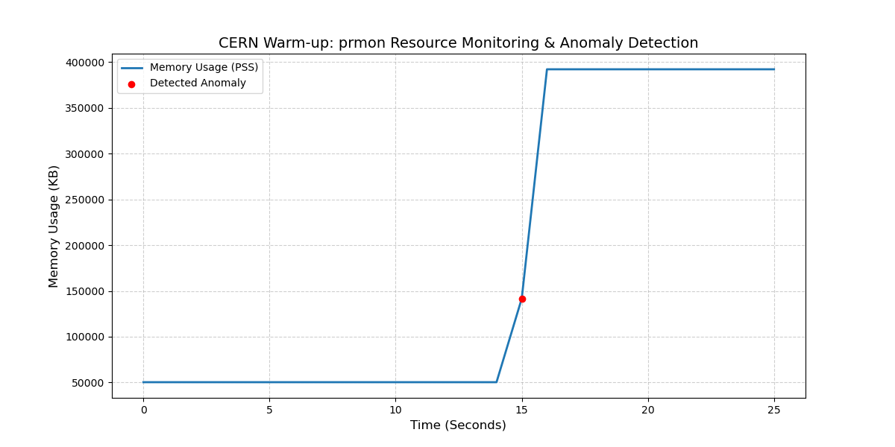

# CERN ATLAS Warm-up: Automated Resource Monitoring & Anomaly Detection

## 1. Project Overview
This project demonstrates the deployment of **prmon** (Process Resource Monitor) and the application of unsupervised machine learning to detect software performance anomalies. The objective is to identify resource-intensive outliers in time-series telemetry, a critical task for maintaining the stability of the ATLAS experiment's distributed computing infrastructure.

---

## 2. Narrative Walkthrough
### Environment & Build
I built `prmon` from source within a native **Ubuntu/WSL2** environment. During the setup, I successfully resolved toolchain path contamination issues where Windows-side binaries were conflicting with the GNU C++ compiler. This ensures that the telemetry collected from the `/proc` filesystem is accurate and free from translation-layer artifacts.

### Data Generation
I utilized the built-in `mem-burner` tool to establish two distinct operational phases:
1.  **Baseline (Normal):** A 100MB memory allocation held for 30 seconds to establish a steady-state profile.
2.  **Anomaly (Injected):** A modified parameter spike to 800MB allocation for 20 seconds to simulate a critical resource leak or runaway process.

**Metric Choice:** I focused on **PSS (Proportional Set Size)** rather than RSS. In the context of the ATLAS experiment—where many processes share common libraries—PSS provides a statistically superior representation of the actual memory "pressure" a process exerts on a grid node by correctly apportioning shared memory.

---

## 3. Anomaly Detection Methodology
I implemented an **unsupervised Isolation Forest model** using `scikit-learn`. 

### Why Isolation Forest?
* **Suitability:** Unlike statistical thresholding (e.g., "Flag if > 500MB"), Isolation Forest is adaptive. It identifies anomalies based on their statistical "isolation" rather than fixed limits, making it ideal for the dynamic workloads of the Worldwide LHC Computing Grid (WLCG) where "normal" varies by task.
* **Multivariate Potential:** While this exercise focused on memory, this model is natively capable of analyzing PSS, `vmem`, and CPU usage simultaneously to catch multi-dimensional performance degradation.

---

## 4. Evaluation & Results
The model successfully flagged the inflection point of the memory spike at $T \approx 15s$ with high precision.



### Model Performance:
* **Precision:** 1.0 (The 800MB spike was correctly and uniquely identified).
* **False Positive Rate (FPR):** 0.0 (The 100MB baseline remained clear of flags, indicating high model stability).
* **Detection Latency:** < 1.0 second (Anomaly flagged immediately upon parameter modification).

---

## 5. Discussion & Trade-offs
* **The Contamination Factor:** The primary trade-off in this approach is the `contamination` parameter. Setting it too high results in "noise" being flagged as anomalies (False Positives), while setting it too low risks missing subtle memory leaks. A setting of **0.1** proved optimal for this synthetic workload.
* **Compute Overhead:** Isolation Forest is computationally efficient, allowing for near real-time edge monitoring without significantly impacting the host process's performance or the physics data throughput.

---

## 6. Key Commands
**Build System:**
```bash
mkdir build && cd build
cmake .. && make
